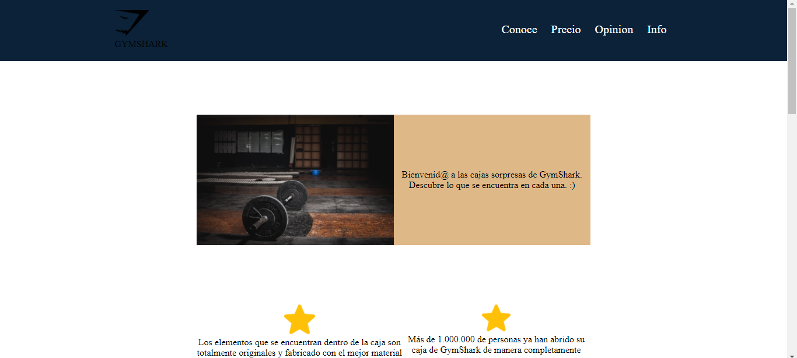

# 💎 Pagina de producto

**Crea una nueva historia**&nbsp; &nbsp; &nbsp;&nbsp;

Este proyecto cuenta con con diseño repsonsivo y adaptativo a cualquier dispositivo según los estandares,  se baso en una pagina de producto de cajas sorpresas.

Puedes verlo aquí: https://jacksonguerrer0.github.io/Pagina_Producto/

## Requerimientos

Requiere un navegador y que se abra el archivo index.html

## 🔥 Instalación

## 🔍 Vistas 

### 💻 Desktop

### 📱 Mobile

## 📌 Stack

<escribe aquí>

## 🌟 Autor

* **Jackson Guerrero**  - [@jacksonguerrer0](https://github.com/jacksonguerrer0)
